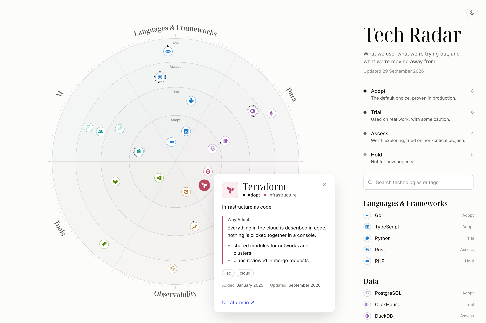

# Tech Radar

A technology radar for a person, a team or a company: an SVG radar with any number
of rings and sectors, driven entirely by a YAML file.

<picture>
  <source media="(prefers-color-scheme: dark)" srcset="docs/screenshot-dark.png">
  
</picture>

- **Data in YAML** — rings, sectors and entries, with descriptions, rationale
  (lightweight Markdown), links, tags and new/moved markers.
- **Icons** for entries, from icon sets, a site's favicon or any image URL.
- **Optional Outline integration** — keep the radar in an [Outline](https://www.getoutline.com)
  document and edit it there, with no redeploys.
- **Light and dark themes**, search, filtering, keyboard navigation.

## Quick start

Requires Node.js 24.

```sh
npm install
npm run dev          # http://localhost:5173, with public/radar.yaml
```

Edit [`public/radar.yaml`](public/radar.yaml) — it is a working example, and the format
is documented in comments at the top of the file. The layout is deterministic: the
same file always gives the same picture.

## Your data

The page loads `radar.yaml` from next to itself — that is all the setup there is:

- **Static hosting**: `npm run build` puts the page and `public/radar.yaml` into `dist/`.
  Upload `dist/` anywhere and replace `dist/radar.yaml` with yours. No server needed;
  the browser then fetches icons from their sources itself.
- **The bundled server**: serves the file at `RADAR_FILE` (the built `dist/radar.yaml`
  by default) and picks up edits on the next page load.
- **Docker**: mount a directory with your file and point `RADAR_FILE` at it:
  ```sh
  docker run -p 8080:8080 -v ./data:/data:ro -e RADAR_FILE=/data/radar.yaml ghcr.io/mymdz/tech-radar
  ```
  or uncomment the lines in `docker-compose.yml`. Mount the directory rather than the
  file: editors that save by renaming would leave a single-file mount on the old version.

Other sources:

- `VITE_RADAR_SOURCE=<url>` at build time — any CORS-enabled URL (a raw GitHub file,
  a gist, S3). JSON works too, it is valid YAML.
- `?source=<url>` in the address — dev server only.
- **Outline**: the server reads the first ` ```yaml ` block of an Outline document and
  serves it as `radar.yaml`, so edits show up within `CACHE_TTL_SECONDS`. Text around
  the block is ignored. An edit that breaks the data (bad YAML, an unknown ring) is
  rejected: the last valid version keeps being served and the page shows why.

## Icons

`icon` takes an image URL or a shorthand: `simple-icons:<slug>`, `iconify:<set>:<name>`,
`devicon:<name>` or `favicon:<domain>`. Without it, the favicon of the entry's first link
is used. The bundled server caches the images; without it the browser fetches them
from their sources.

## Server

`server/` serves the built page, `/radar.yaml` and `/icon`, with no framework and no
build step (Node 24 runs the TypeScript directly).

```sh
npm run build && npm start                        # http://localhost:8080
docker run -p 8080:8080 ghcr.io/mymdz/tech-radar  # the published image (amd64, arm64)
docker compose up --build                         # built from source
```

| Variable | Default | |
|---|---|---|
| `PORT` | `8080` | |
| `STATIC_DIR` | `dist` | the built page |
| `RADAR_FILE` | `$STATIC_DIR/radar.yaml` | the radar data, when not read from Outline |
| `ICON_CACHE_DIR` | `.icon-cache` | the icon file cache |
| `OUTLINE_BASE_URL` | | e.g. `https://outline.example.com` |
| `OUTLINE_SHARE_ID` | | a publicly shared document, no token needed |
| `OUTLINE_API_TOKEN`, `OUTLINE_DOCUMENT_ID` | | a private document |
| `CACHE_TTL_SECONDS` | `30` | how often Outline is asked |

Without `OUTLINE_*` the radar is read from `RADAR_FILE`. `npm start` reads a `.env` file
if there is one.

## Development

```sh
npm test               # typecheck + tests
npm run check:icons    # check that every icon in a radar file loads
make docker-build      # build and push an image: IMAGE=registry/name PLATFORM=linux/arm64
```

Images for amd64 and arm64 are published to `ghcr.io/mymdz/tech-radar` by
[a workflow](.github/workflows/docker.yml): `latest` from `main`, a version for each
`v*` tag. Pull requests are built and tested but not published.

```
src/
  data/       loading and validating the data
  icons/      resolving and drawing icons
  radar/      geometry (layout.ts) and SVG rendering (render.ts)
  ui/         side panel, tooltip, theme
server/       page, radar.yaml from Outline, icon cache
scripts/      check-icons.ts
```

## License

[MIT](LICENSE)
